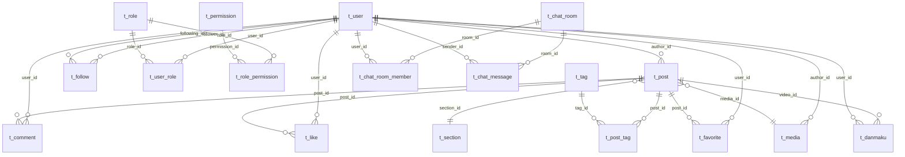
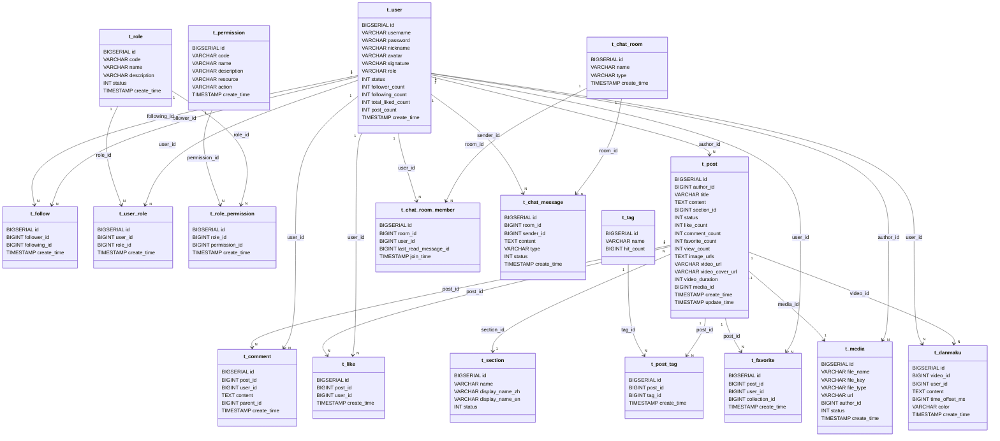
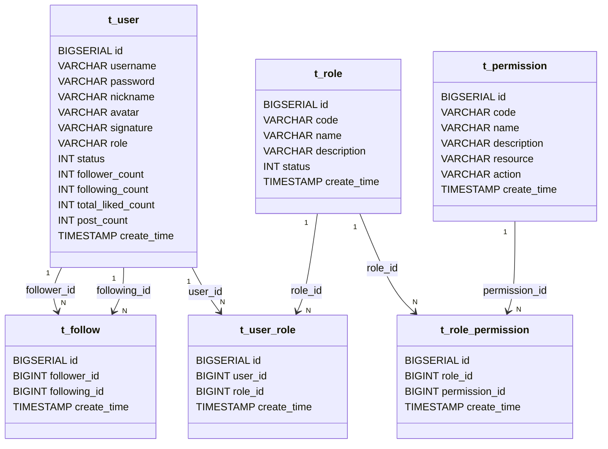
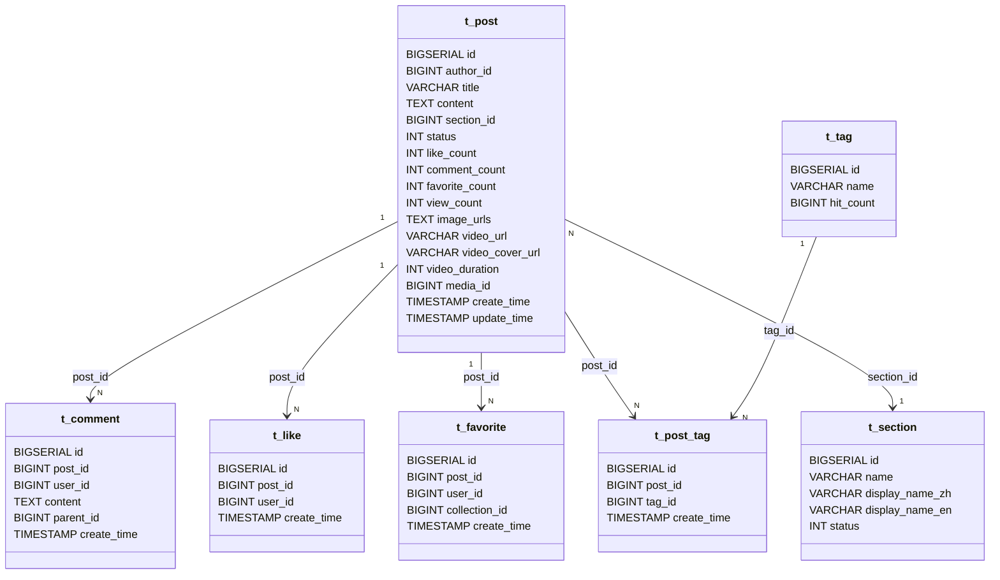
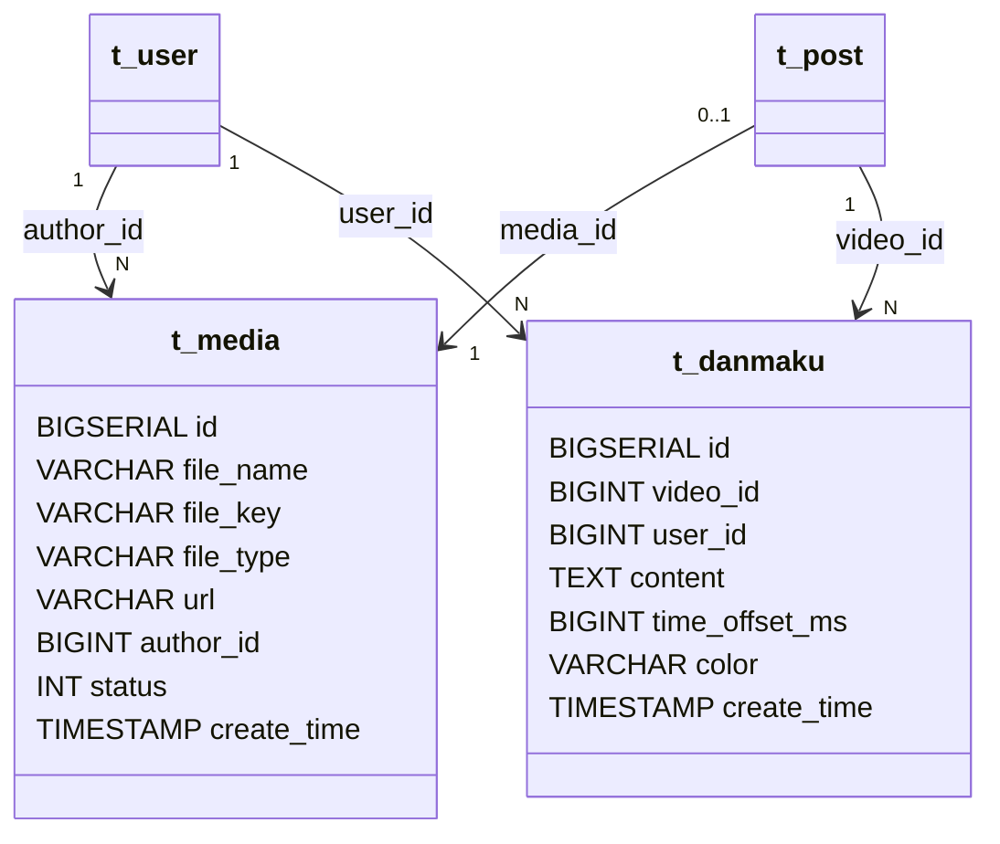
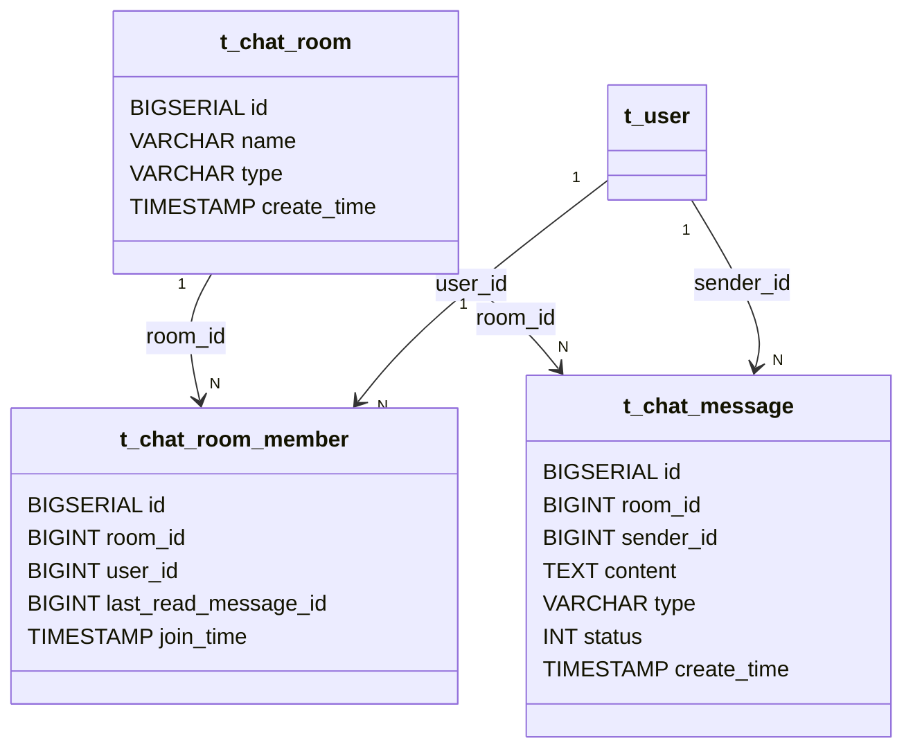

SideQuestCommunity 数据库说明

概览
- 数据库类型: PostgreSQL
- 表前缀: t_
- 主要模块: identity, core, media, chat
- 初始化脚本: `infra/docker-compose/postgres/init.sql`
- 服务内 schema:
  - identity: `backend/sidequest-identity/src/main/resources/schema.sql`
  - core: `backend/sidequest-core/src/main/resources/schema.sql`
  - media: `backend/sidequest-media/src/main/resources/schema.sql`
- 说明: chat 相关表目前仅在 init.sql 中定义
- 关系约束: 当前 SQL 未显式声明外键，表之间依赖为逻辑约定

相关文档
- 需求分析: `doc/requirements-analysis.md`
- 项目时间线: `doc/project-timeline.md`
- 微服务拓扑: `doc/microservices-topology.md`
- 接口定义: `doc/openapi.yaml`
- 部署手册: `deployment-guide.md`

Mermaid ER 图

Mermaid UML 关系图

模块 UML 关系图（分块）

Identity 模块

Core 模块

Media 模块

Chat 模块

数据库定义
以下字段与约束以 `infra/docker-compose/postgres/init.sql` 为准。

identity 模块
t_user
- id BIGSERIAL PK
- username VARCHAR(64) UNIQUE NOT NULL
- password VARCHAR(128) NOT NULL
- nickname VARCHAR(64)
- avatar VARCHAR(255)
- signature VARCHAR(255)
- role VARCHAR(20) DEFAULT 'USER' (primary role for compatibility)
- status INT DEFAULT 0 (0: 正常, 1: 封禁, 2: 删除)
- follower_count INT DEFAULT 0
- following_count INT DEFAULT 0
- total_liked_count INT DEFAULT 0
- post_count INT DEFAULT 0
- create_time TIMESTAMP DEFAULT CURRENT_TIMESTAMP

t_follow
- id BIGSERIAL PK
- follower_id BIGINT NOT NULL
- following_id BIGINT NOT NULL
- create_time TIMESTAMP DEFAULT CURRENT_TIMESTAMP
- UNIQUE(follower_id, following_id)

t_role
- id BIGSERIAL PK
- code VARCHAR(64) UNIQUE NOT NULL
- name VARCHAR(64)
- description VARCHAR(255)
- status INT DEFAULT 0 (0: ACTIVE, 1: DISABLED)
- create_time TIMESTAMP DEFAULT CURRENT_TIMESTAMP

t_permission
- id BIGSERIAL PK
- code VARCHAR(128) UNIQUE NOT NULL
- name VARCHAR(64)
- description VARCHAR(255)
- resource VARCHAR(128)
- action VARCHAR(64)
- create_time TIMESTAMP DEFAULT CURRENT_TIMESTAMP

t_user_role
- id BIGSERIAL PK
- user_id BIGINT NOT NULL
- role_id BIGINT NOT NULL
- create_time TIMESTAMP DEFAULT CURRENT_TIMESTAMP
- UNIQUE(user_id, role_id)

t_role_permission
- id BIGSERIAL PK
- role_id BIGINT NOT NULL
- permission_id BIGINT NOT NULL
- create_time TIMESTAMP DEFAULT CURRENT_TIMESTAMP
- UNIQUE(role_id, permission_id)

core 模块
t_post
- id BIGSERIAL PK
- author_id BIGINT NOT NULL
- title VARCHAR(255)
- content TEXT
- section_id BIGINT
- status INT DEFAULT 0 (0: 审核中, 1: 正常, 2: 封禁, 3: 删除)
- like_count INT DEFAULT 0
- comment_count INT DEFAULT 0
- favorite_count INT DEFAULT 0
- view_count INT DEFAULT 0
- image_urls TEXT
- video_url VARCHAR(255)
- video_cover_url VARCHAR(255)
- video_duration INT DEFAULT 0
- media_id BIGINT
- create_time TIMESTAMP DEFAULT CURRENT_TIMESTAMP
- update_time TIMESTAMP DEFAULT CURRENT_TIMESTAMP

t_comment
- id BIGSERIAL PK
- post_id BIGINT NOT NULL
- user_id BIGINT NOT NULL
- content TEXT NOT NULL
- parent_id BIGINT
- create_time TIMESTAMP DEFAULT CURRENT_TIMESTAMP

t_like
- id BIGSERIAL PK
- post_id BIGINT NOT NULL
- user_id BIGINT NOT NULL
- create_time TIMESTAMP DEFAULT CURRENT_TIMESTAMP
- UNIQUE(post_id, user_id)

t_favorite
- id BIGSERIAL PK
- post_id BIGINT NOT NULL
- user_id BIGINT NOT NULL
- collection_id BIGINT
- create_time TIMESTAMP DEFAULT CURRENT_TIMESTAMP

t_section
- id BIGSERIAL PK
- name VARCHAR(64) UNIQUE NOT NULL
- display_name_zh VARCHAR(64)
- display_name_en VARCHAR(64)
- status INT DEFAULT 0 (0: 正常, 1: 隐藏)

t_tag
- id BIGSERIAL PK
- name VARCHAR(64) UNIQUE NOT NULL
- hit_count BIGINT DEFAULT 0

t_post_tag
- id BIGSERIAL PK
- post_id BIGINT NOT NULL
- tag_id BIGINT NOT NULL
- create_time TIMESTAMP DEFAULT CURRENT_TIMESTAMP
- UNIQUE(post_id, tag_id)

media 模块
t_media
- id BIGSERIAL PK
- file_name VARCHAR(255)
- file_key VARCHAR(255)
- file_type VARCHAR(32) (image, video)
- url VARCHAR(512)
- author_id BIGINT
- status INT DEFAULT 0 (0: PROCESSING, 1: READY, 2: FAILED)
- create_time TIMESTAMP DEFAULT CURRENT_TIMESTAMP

t_danmaku
- id BIGSERIAL PK
- video_id BIGINT NOT NULL
- user_id BIGINT NOT NULL
- content TEXT NOT NULL
- time_offset_ms BIGINT NOT NULL
- color VARCHAR(32)
- create_time TIMESTAMP DEFAULT CURRENT_TIMESTAMP
- 索引: idx_danmaku_video_id(video_id)

chat 模块
t_chat_room
- id BIGSERIAL PK
- name VARCHAR(64)
- type VARCHAR(20) (PRIVATE, GROUP)
- create_time TIMESTAMP DEFAULT CURRENT_TIMESTAMP

t_chat_room_member
- id BIGSERIAL PK
- room_id BIGINT NOT NULL
- user_id BIGINT NOT NULL
- last_read_message_id BIGINT DEFAULT 0
- join_time TIMESTAMP DEFAULT CURRENT_TIMESTAMP
- UNIQUE(room_id, user_id)

t_chat_message
- id BIGSERIAL PK
- room_id BIGINT NOT NULL
- sender_id BIGINT NOT NULL
- content TEXT
- type VARCHAR(20) (TEXT, IMAGE, VIDEO)
- status INT DEFAULT 0
- create_time TIMESTAMP DEFAULT CURRENT_TIMESTAMP

数据库结构归属
- identity 模块: t_user, t_follow, t_role, t_permission, t_user_role, t_role_permission
- core 模块: t_post, t_comment, t_like, t_favorite, t_section, t_tag, t_post_tag
- media 模块: t_media, t_danmaku
- chat 模块: t_chat_room, t_chat_room_member, t_chat_message

索引与约束清单
- t_user.username: UNIQUE
- t_follow(follower_id, following_id): UNIQUE
- t_role.code: UNIQUE
- t_permission.code: UNIQUE
- t_user_role(user_id, role_id): UNIQUE
- t_role_permission(role_id, permission_id): UNIQUE
- t_user_role.user_id: INDEX (idx_user_role_user_id)
- t_user_role.role_id: INDEX (idx_user_role_role_id)
- t_role_permission.role_id: INDEX (idx_role_perm_role_id)
- t_role_permission.permission_id: INDEX (idx_role_perm_perm_id)
- t_like(post_id, user_id): UNIQUE
- t_section.name: UNIQUE
- t_tag.name: UNIQUE
- t_post_tag(post_id, tag_id): UNIQUE
- t_post_tag.post_id: INDEX (idx_post_tag_post_id)
- t_post_tag.tag_id: INDEX (idx_post_tag_tag_id)
- t_chat_room_member(room_id, user_id): UNIQUE
- t_danmaku.video_id: INDEX (idx_danmaku_video_id)

初始化数据
- init.sql 内置用户: admin, alice, bob
- init.sql 内置角色与权限: ADMIN/USER + 相关权限，并为 admin 绑定 ADMIN
- init.sql 内置分区: design, ui, food
- identity/schema.sql 内置 admin 用户与默认角色/权限

备注
- `backend/**/schema.sql` 与 init.sql 字段基本一致，若有差异以 init.sql 为准
- 标签通过 t_post_tag 进行规范化关联，t_tag 维护标签字典与热度
