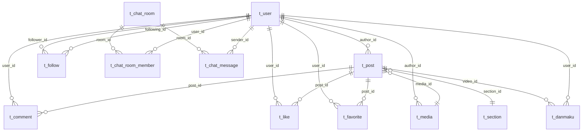
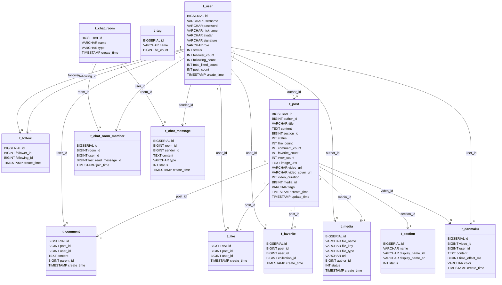

SideQuestCommunity 数据库说明

概述
- 数据库类型: PostgreSQL
- 表前缀: t_
- 主要模块: identity, core, media, chat
- 主要脚本: infra/docker-compose/postgres/init.sql

Mermaid ER 图

Mermaid UML 关系图

数据库定义
以下字段定义以 `infra/docker-compose/postgres/init.sql` 为准。

t_user
- id BIGSERIAL PK
- username VARCHAR(64) UNIQUE NOT NULL
- password VARCHAR(128) NOT NULL
- nickname VARCHAR(64)
- avatar VARCHAR(255)
- signature VARCHAR(255)
- role VARCHAR(20) DEFAULT 'USER'
- status INT DEFAULT 0 (0: 正常, 1: 封禁, 2: 删除)
- follower_count INT DEFAULT 0
- following_count INT DEFAULT 0
- total_liked_count INT DEFAULT 0
- post_count INT DEFAULT 0
- create_time TIMESTAMP DEFAULT CURRENT_TIMESTAMP

t_follow
- id BIGSERIAL PK
- follower_id BIGINT NOT NULL
- following_id BIGINT NOT NULL
- create_time TIMESTAMP DEFAULT CURRENT_TIMESTAMP
- UNIQUE(follower_id, following_id)

t_post
- id BIGSERIAL PK
- author_id BIGINT NOT NULL
- title VARCHAR(255)
- content TEXT
- section_id BIGINT
- status INT DEFAULT 0 (0: 审核中, 1: 正常, 2: 封禁, 3: 删除)
- like_count INT DEFAULT 0
- comment_count INT DEFAULT 0
- favorite_count INT DEFAULT 0
- view_count INT DEFAULT 0
- image_urls TEXT
- video_url VARCHAR(255)
- video_cover_url VARCHAR(255)
- video_duration INT DEFAULT 0
- media_id BIGINT
- tags VARCHAR(255)
- create_time TIMESTAMP DEFAULT CURRENT_TIMESTAMP
- update_time TIMESTAMP DEFAULT CURRENT_TIMESTAMP

t_comment
- id BIGSERIAL PK
- post_id BIGINT NOT NULL
- user_id BIGINT NOT NULL
- content TEXT NOT NULL
- parent_id BIGINT
- create_time TIMESTAMP DEFAULT CURRENT_TIMESTAMP

t_like
- id BIGSERIAL PK
- post_id BIGINT NOT NULL
- user_id BIGINT NOT NULL
- create_time TIMESTAMP DEFAULT CURRENT_TIMESTAMP
- UNIQUE(post_id, user_id)

t_favorite
- id BIGSERIAL PK
- post_id BIGINT NOT NULL
- user_id BIGINT NOT NULL
- collection_id BIGINT
- create_time TIMESTAMP DEFAULT CURRENT_TIMESTAMP

t_section
- id BIGSERIAL PK
- name VARCHAR(64) NOT NULL
- display_name_zh VARCHAR(64)
- display_name_en VARCHAR(64)
- status INT DEFAULT 0 (0: 正常, 1: 隐藏)

t_tag
- id BIGSERIAL PK
- name VARCHAR(64) UNIQUE NOT NULL
- hit_count BIGINT DEFAULT 0

t_media
- id BIGSERIAL PK
- file_name VARCHAR(255)
- file_key VARCHAR(255)
- file_type VARCHAR(32) (image, video)
- url VARCHAR(512)
- author_id BIGINT
- status INT DEFAULT 0 (0: PROCESSING, 1: READY, 2: FAILED)
- create_time TIMESTAMP DEFAULT CURRENT_TIMESTAMP

t_danmaku
- id BIGSERIAL PK
- video_id BIGINT NOT NULL
- user_id BIGINT NOT NULL
- content TEXT NOT NULL
- time_offset_ms BIGINT NOT NULL
- color VARCHAR(32)
- create_time TIMESTAMP DEFAULT CURRENT_TIMESTAMP
- 索引: idx_danmaku_video_id(video_id)

t_chat_room
- id BIGSERIAL PK
- name VARCHAR(64)
- type VARCHAR(20) (PRIVATE, GROUP)
- create_time TIMESTAMP DEFAULT CURRENT_TIMESTAMP

t_chat_room_member
- id BIGSERIAL PK
- room_id BIGINT NOT NULL
- user_id BIGINT NOT NULL
- last_read_message_id BIGINT DEFAULT 0
- join_time TIMESTAMP DEFAULT CURRENT_TIMESTAMP
- UNIQUE(room_id, user_id)

t_chat_message
- id BIGSERIAL PK
- room_id BIGINT NOT NULL
- sender_id BIGINT NOT NULL
- content TEXT
- type VARCHAR(20) (TEXT, IMAGE, VIDEO)
- status INT DEFAULT 0
- create_time TIMESTAMP DEFAULT CURRENT_TIMESTAMP

数据库结构
- identity 模块: t_user, t_follow
- core 模块: t_post, t_comment, t_like, t_favorite, t_section, t_tag
- media 模块: t_media, t_danmaku
- chat 模块: t_chat_room, t_chat_room_member, t_chat_message

备注
- `backend/**/schema.sql` 与 init.sql 字段基本一致，若有差异以 init.sql 为准。
