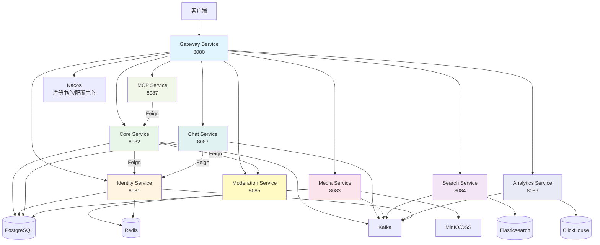
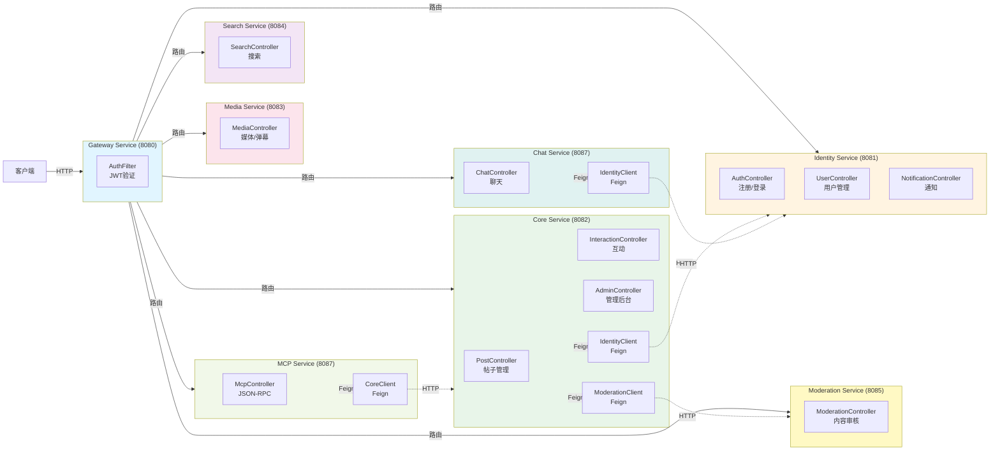
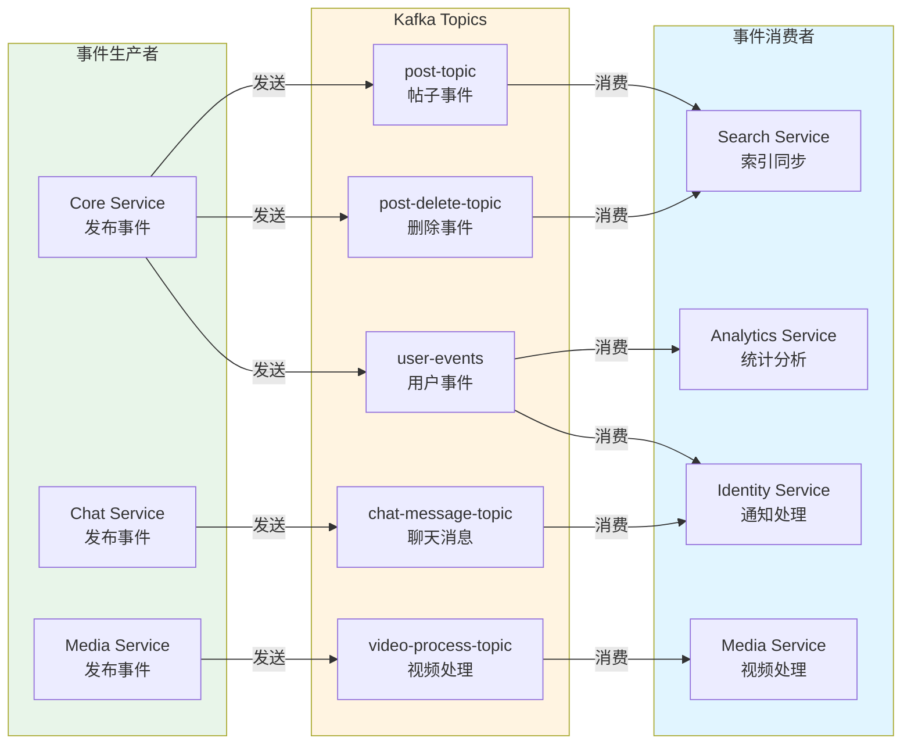
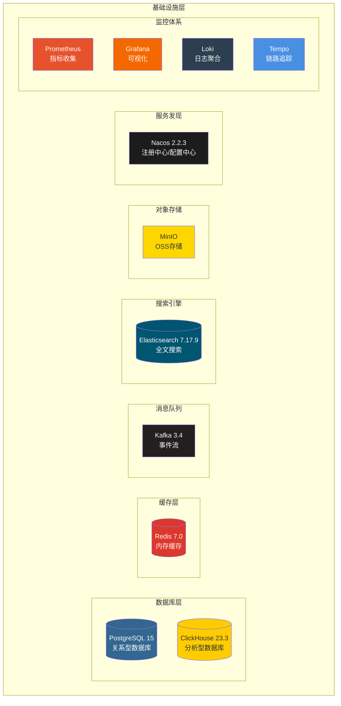
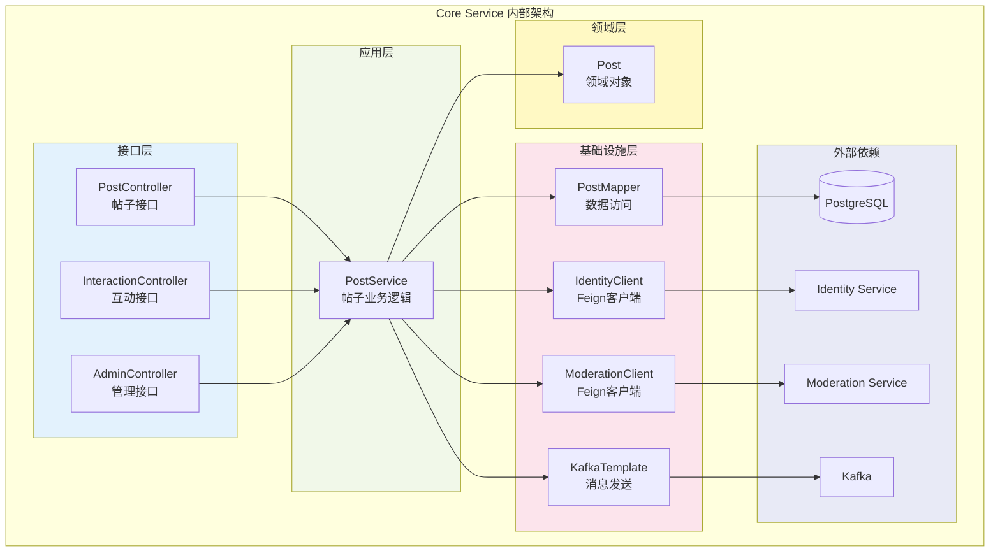
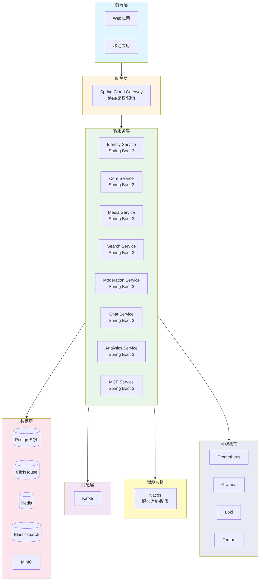

# 微服务组件拓扑图

## 概览

本文档包含SideQuest社区项目的微服务架构拓扑图，包括服务间调用关系、数据流、消息流和组件架构。

---

## 1. 概览拓扑图（高层架构）

系统采用微服务架构，所有外部请求首先经过Gateway Service（8080端口）统一入口，Gateway负责JWT Token验证、路由转发和跨域处理。客户端请求通过Gateway路由到对应的业务服务：Identity Service处理用户认证和身份管理，Core Service承载核心业务逻辑（帖子、评论、互动），Media Service管理媒体文件和弹幕，Search Service提供全文搜索能力，Moderation Service负责内容审核，Chat Service处理实时聊天，Analytics Service进行数据统计分析，MCP Service提供模型上下文协议支持。

服务间通过Feign客户端进行同步调用，Core Service需要获取用户信息时调用Identity Service，进行内容审核时调用Moderation Service；Chat Service和MCP Service也通过Feign调用Identity Service和Core Service。数据持久化方面，Identity、Core、Chat、Media四个服务共享PostgreSQL数据库存储结构化数据，Media Service和Identity Service使用Redis缓存弹幕和未读通知等实时数据，Search Service依赖Elasticsearch提供全文搜索能力，Analytics Service将事件数据写入ClickHouse进行分析查询。异步事件通过Kafka消息队列流转，Core Service发布帖子事件和用户行为事件，Chat Service发布聊天消息事件，Media Service发布视频处理任务，这些事件被Search Service、Analytics Service、Identity Service等消费者处理，实现搜索索引同步、统计分析、通知推送等功能。Media Service还通过MinIO对象存储管理图片和视频文件，Gateway Service通过Nacos进行服务注册和配置管理。

---

## 2. 详细拓扑图（包含接口、数据表、消息主题）

### 2.1 服务调用关系图

客户端请求首先到达Gateway Service的AuthFilter组件，该组件负责JWT Token验证，验证通过后添加用户上下文信息（X-User-Id和X-User-Role）并转发到对应的业务服务。Gateway根据路径前缀将请求路由到不同的服务：`/api/identity/**`路由到Identity Service的AuthController、UserController或NotificationController，`/api/core/**`路由到Core Service的PostController、InteractionController或AdminController，其他路径类似路由到对应的Controller。

服务间的同步调用通过Feign客户端实现，Core Service通过IdentityClient调用Identity Service获取用户信息，通过ModerationClient调用Moderation Service进行内容审核；Chat Service通过IdentityClient获取用户信息用于聊天功能；MCP Service通过CoreClient调用Core Service创建帖子和评论。这些Feign调用在服务内部封装为接口，对外表现为HTTP请求，实现了服务间的解耦和通信。

### 2.2 数据流图

系统的数据存储分为三个层次：PostgreSQL作为主要的关系型数据库存储持久化数据，Redis作为缓存层存储实时数据，ClickHouse作为分析型数据库存储事件数据。Identity Service负责用户和关注关系的管理，读写t_user和t_follow表，同时使用Redis的Hash结构存储未读通知计数（key为`unread:{userId}`），实现通知状态的快速查询和更新。

Core Service作为核心业务服务，管理帖子、评论、点赞、收藏等核心数据，读写t_post、t_comment、t_like、t_favorite、t_section、t_tag等表，这些表构成了社区内容的基础数据结构。Media Service管理媒体文件元数据，将文件信息存储在t_media表中，同时将弹幕数据存储在Redis的ZSet结构中（key为`danmaku:{videoId}`），利用ZSet的有序特性按时间偏移快速检索弹幕。Chat Service管理聊天相关的所有数据，包括聊天室（t_chat_room）、成员关系（t_chat_room_member）和消息内容（t_chat_message），支持私聊和群聊功能。Analytics Service作为数据分析服务，不直接操作业务数据，而是将Kafka事件流中的数据写入ClickHouse的events表，用于后续的数据分析和报表生成。

```mermaid
graph TB
    subgraph Services["微服务"]
        Identity[Identity Service]
        Core[Core Service]
        Media[Media Service]
        Chat[Chat Service]
        Analytics[Analytics Service]
    end
    
    subgraph PostgreSQL["PostgreSQL Database"]
        UserTable[(t_user)]
        FollowTable[(t_follow)]
        PostTable[(t_post)]
        CommentTable[(t_comment)]
        LikeTable[(t_like)]
        FavoriteTable[(t_favorite)]
        SectionTable[(t_section)]
        TagTable[(t_tag)]
        MediaTable[(t_media)]
        ChatRoomTable[(t_chat_room)]
        ChatMemberTable[(t_chat_room_member)]
        ChatMessageTable[(t_chat_message)]
    end
    
    subgraph Redis["Redis Cache"]
        DanmakuCache[弹幕缓存<br/>danmaku:videoId]
        UnreadCache[未读通知缓存<br/>unread:userId]
    end
    
    subgraph ClickHouse["ClickHouse"]
        EventsTable[(events表<br/>事件数据)]
    end
    
    Identity -->|读写| UserTable
    Identity -->|读写| FollowTable
    Identity -->|读写| UnreadCache
    
    Core -->|读写| PostTable
    Core -->|读写| CommentTable
    Core -->|读写| LikeTable
    Core -->|读写| FavoriteTable
    Core -->|读写| SectionTable
    Core -->|读写| TagTable
    
    Media -->|读写| MediaTable
    Media -->|读写| DanmakuCache
    
    Chat -->|读写| ChatRoomTable
    Chat -->|读写| ChatMemberTable
    Chat -->|读写| ChatMessageTable
    
    Analytics -->|写入| EventsTable
    
    style PostgreSQL fill:#336791,color:#fff
    style Redis fill:#dc382d,color:#fff
    style ClickHouse fill:#ffcc02
```

### 2.3 消息流图（Kafka事件流）

系统采用事件驱动架构，通过Kafka实现服务间的异步解耦。Core Service作为主要的事件生产者，在帖子创建、更新、删除时发布事件到`post-topic`和`post-delete-topic`，在用户进行评论、点赞、收藏等操作时发布用户行为事件到`user-events`主题。Chat Service在用户发送消息时发布事件到`chat-message-topic`，通知其他服务有新消息产生。Media Service在需要处理视频时发布任务到`video-process-topic`，触发异步视频转码流程。

这些事件被多个消费者并行处理，实现不同的业务目标。Search Service监听`post-topic`和`post-delete-topic`，当有新帖子发布时自动创建或更新Elasticsearch索引，当帖子删除时同步删除索引，保证搜索结果的实时性。Analytics Service监听`user-events`主题，将所有用户行为事件持久化到ClickHouse，为数据分析和报表提供数据源。Identity Service同时监听`user-events`和`chat-message-topic`，根据事件类型更新用户的未读通知计数，实现通知功能的实时更新。Media Service自身也消费`video-process-topic`，处理视频转码任务并更新媒体文件状态。这种事件驱动模式实现了服务间的松耦合，提高了系统的可扩展性和容错能力。

---

## 3. 组件架构图

### 3.1 基础设施层架构

基础设施层为整个微服务系统提供数据存储、消息传递、服务发现和监控能力。数据库层包含PostgreSQL和ClickHouse两个数据库，PostgreSQL作为关系型数据库存储所有业务数据，支持ACID事务保证数据一致性；ClickHouse作为列式分析数据库，专门用于存储和分析大量事件数据，支持实时OLAP查询。缓存层使用Redis提供高性能的内存存储，用于存储弹幕、未读通知等需要快速访问的实时数据，通过内存读写大幅提升响应速度。

消息队列层使用Kafka实现事件流处理，支持高吞吐量的消息发布和订阅，通过分区机制实现水平扩展和负载均衡。搜索引擎层使用Elasticsearch提供全文搜索能力，通过IK分词器支持中文分词，为搜索服务提供强大的检索功能。对象存储层使用MinIO提供OSS能力，存储图片和视频等大文件，支持预签名URL实现前端直传，减轻服务端压力。服务发现层使用Nacos作为注册中心和配置中心，实现服务的自动注册发现和配置的统一管理，支持配置的动态更新和版本控制。监控体系包含Prometheus收集指标数据，Grafana进行可视化展示，Loki聚合日志，Tempo追踪分布式链路，形成完整的可观测性体系，帮助运维人员快速定位问题和优化性能。

### 3.2 服务内部组件架构（以Core Service为例）

Core Service采用DDD（领域驱动设计）的分层架构，从外到内分为接口层、应用层、领域层和基础设施层。接口层包含PostController、InteractionController和AdminController三个Controller，分别处理帖子管理、用户互动和管理后台的HTTP请求，负责参数验证、结果封装和异常处理。应用层的PostService包含核心业务逻辑，协调领域对象和基础设施组件完成业务功能，例如创建帖子时需要调用ModerationClient进行内容审核，审核通过后保存到数据库，并发送Kafka事件通知搜索服务更新索引。

领域层的Post对象是业务领域的核心实体，包含帖子的业务规则和状态，不依赖外部技术实现，保证了业务逻辑的纯净性。基础设施层提供技术实现，PostMapper负责数据库的CRUD操作，IdentityClient和ModerationClient通过Feign调用其他服务，KafkaTemplate负责发送异步事件。这种分层架构实现了关注点分离，业务逻辑与技术实现解耦，提高了代码的可维护性和可测试性，同时通过依赖倒置原则，使得领域层不依赖基础设施层，保证了架构的灵活性。

### 3.3 完整技术栈架构

整个系统采用分层架构，从前端到基础设施形成完整的技术栈。前端层包括Web应用和移动应用，通过HTTP/HTTPS协议与后端通信。网关层使用Spring Cloud Gateway作为统一入口，提供路由转发、JWT鉴权、限流熔断等功能，所有外部请求必须经过网关，保证了系统的安全性和统一性。

微服务层包含8个Spring Boot 3应用，每个服务独立部署、独立扩展，通过Nacos进行服务注册和发现，服务间通过Feign进行同步调用，通过Kafka进行异步通信。数据层提供多种存储方案：PostgreSQL存储结构化业务数据，ClickHouse存储分析型数据，Redis提供缓存和实时数据存储，Elasticsearch提供全文搜索，MinIO提供对象存储，不同的数据特性选择不同的存储方案，实现了数据存储的最优化。消息层使用Kafka实现事件驱动架构，支持高并发的事件发布和订阅。服务网格层通过Nacos实现服务治理，包括服务注册发现、配置管理、负载均衡等功能。可观测性层通过Prometheus、Grafana、Loki、Tempo形成完整的监控体系，实现指标监控、日志查询、链路追踪等功能，为系统的稳定运行提供保障。

---

## 4. 服务描述

### 4.1 Gateway Service (网关服务)

Gateway Service运行在8080端口，作为整个系统的统一入口，承担着API网关的核心职责。它使用Spring Cloud Gateway框架，通过AuthFilter组件对所有进入系统的请求进行JWT Token验证，只有携带有效Token的请求才能访问需要认证的接口，公开接口如登录、注册则可以直接通过。验证通过后，Gateway会在请求头中添加X-User-Id和X-User-Role信息，传递给下游服务，使下游服务能够识别当前用户身份。Gateway还负责根据路径前缀将请求路由到对应的微服务：`/api/identity/**`路由到identity-service，`/api/core/**`路由到core-service，其他路径类似路由到对应的服务。同时Gateway处理CORS跨域问题，允许前端应用从不同域名访问API，保证了前后端分离架构的正常运行。

### 4.2 Identity Service (身份服务)

Identity Service运行在8081端口，是系统的身份认证和用户管理核心服务。它使用Spring Boot 3、MyBatis-Plus、PostgreSQL、Redis和Kafka构建，负责用户注册、登录、JWT Token生成、用户信息管理、关注关系和通知管理等核心功能。用户注册时，服务将用户信息保存到PostgreSQL的t_user表中，密码使用BCrypt加密存储；用户登录时验证用户名密码，成功后生成JWT Token返回给客户端。用户关注关系存储在t_follow表中，支持用户之间的关注和取消关注操作。

通知功能通过Redis和Kafka协同实现，Redis使用Hash结构存储每个用户的未读通知计数（key为`unread:{userId}`），包含chat、interaction、system三个类型的未读数。Identity Service监听Kafka的`user-events`和`chat-message-topic`主题，当收到用户互动事件或聊天消息事件时，自动更新对应用户的未读通知计数，实现通知的实时更新。服务提供完整的REST API接口，包括注册登录、用户信息查询、关注操作和通知查询等，为其他服务提供用户身份和权限相关的功能支持。

### 4.3 Core Service (核心业务服务)

Core Service运行在8082端口，是整个社区平台的核心业务服务，承载着帖子管理、用户互动、内容审核等核心功能。它使用Spring Boot 3、MyBatis-Plus、PostgreSQL和Kafka构建，采用DDD分层架构设计。服务管理PostgreSQL中的多个业务表：t_post存储帖子内容，t_comment存储评论，t_like存储点赞关系，t_favorite存储收藏关系，t_section和t_tag分别存储分区和标签信息。

当用户创建帖子时，Core Service首先通过ModerationClient调用Moderation Service进行内容审核，审核通过后将帖子保存到数据库，并发送事件到Kafka的`post-topic`主题，触发Search Service更新搜索索引。用户进行评论、点赞、收藏等操作时，服务更新对应的数据表，并发送用户行为事件到`user-events`主题，供Analytics Service和Identity Service消费。服务还通过IdentityClient获取用户信息，用于在帖子列表中展示作者信息。管理后台功能通过AdminController提供，支持管理员审核帖子、删除帖子等操作。整个服务通过事件驱动模式与其他服务解耦，通过Feign客户端实现服务间同步调用，形成了完整的业务闭环。

### 4.4 Media Service (媒体服务)

Media Service运行在8083端口，负责媒体文件的管理和弹幕功能。它使用Spring Boot 3、MyBatis-Plus、PostgreSQL、Redis和Kafka构建，支持图片和视频的上传、存储和处理。当用户需要上传文件时，服务生成OSS预签名URL返回给前端，前端直接上传到MinIO对象存储，避免了文件流经服务端，减轻了服务端压力。媒体文件的元数据（文件名、URL、状态等）存储在PostgreSQL的t_media表中，支持查询和管理。

视频处理采用异步模式，当视频上传完成后，服务发送处理任务到Kafka的`video-process-topic`主题，然后由服务自身的VideoProcessConsumer消费该主题，执行视频转码等处理任务，处理完成后更新媒体文件状态。弹幕功能使用Redis的ZSet结构存储，key为`danmaku:{videoId}`，score为弹幕的时间偏移（毫秒），这样可以根据视频播放时间快速检索对应时间段的弹幕，实现了高效的弹幕查询功能。服务提供完整的REST API接口，支持媒体列表查询、上传URL获取、处理状态查询和弹幕的发送与查询。

### 4.5 Search Service (搜索服务)

Search Service运行在8084端口，提供全文搜索能力，使用Elasticsearch作为搜索引擎。它使用Spring Boot 3和Spring Data Elasticsearch构建，通过Kafka事件实现搜索索引的实时同步。服务监听Kafka的`post-topic`和`post-delete-topic`主题，当Core Service发布帖子创建或更新事件时，Search Service自动将帖子数据同步到Elasticsearch的`posts`索引中，当帖子删除时同步删除索引，保证了搜索结果的实时性和准确性。

Elasticsearch索引使用IK分词器进行中文分词，支持`ik_max_word`和`ik_smart`两种分词模式，能够准确处理中文搜索需求。服务提供两个搜索接口：`/api/search/posts`支持关键词搜索帖子，`/api/search/user/posts`支持搜索特定用户的帖子，两个接口都支持分页查询，返回按创建时间倒序排列的搜索结果。通过事件驱动模式，搜索索引与业务数据保持同步，用户搜索时能够获取最新的内容。

### 4.6 Moderation Service (审核服务)

Moderation Service运行在8085端口，负责内容审核功能，确保平台内容的安全性和合规性。它使用Spring Boot 3构建，是一个轻量级的审核服务。当Core Service创建帖子或用户发表评论时，会调用Moderation Service的审核接口，服务使用正则表达式匹配敏感词，敏感词列表从配置文件中读取。如果检测到敏感内容，返回审核不通过，否则返回审核通过。

目前服务功能较为简单，只支持文本审核，敏感词管理也较为基础。在实际生产环境中，可以扩展支持图片审核、视频审核、敏感词分级管理、审核记录存储等功能，形成完整的审核体系。服务通过REST API提供审核接口，其他服务通过Feign客户端调用，实现了审核功能的解耦和复用。

### 4.7 Chat Service (聊天服务)

Chat Service运行在8087端口，提供实时聊天功能，支持私聊和群聊。它使用Spring Boot 3、MyBatis-Plus、PostgreSQL、Redis和Kafka构建，管理聊天室、成员关系和消息内容。聊天室信息存储在t_chat_room表中，成员关系存储在t_chat_room_member表中，每条消息存储在t_chat_message表中，支持消息的持久化存储和查询。

当用户发送消息时，服务将消息保存到数据库，并发送事件到Kafka的`chat-message-topic`主题，通知Identity Service更新未读通知计数。服务通过IdentityClient获取用户信息，用于在聊天界面展示用户昵称和头像。消息已读状态通过t_chat_room_member表的last_read_message_id字段管理，用户可以查询未读消息数量。服务提供完整的聊天API接口，支持聊天室列表查询、消息列表查询、消息发送和已读标记等功能，为前端提供完整的聊天能力。

### 4.8 Analytics Service (分析服务)

Analytics Service运行在8086端口，负责数据分析和统计功能，为运营和决策提供数据支持。它使用Spring Boot 3、ClickHouse和Kafka构建，采用事件驱动模式收集和分析用户行为数据。服务监听Kafka的`user-events`主题，当Core Service发布用户行为事件（如发帖、评论、点赞、收藏）时，Analytics Service将这些事件持久化到ClickHouse的events表中。

ClickHouse作为列式分析数据库，非常适合存储和分析大量事件数据，支持实时OLAP查询和聚合分析。服务提供数据分析接口，包括统计概览和热门帖子查询，为管理后台和运营人员提供数据支持。通过事件驱动模式，Analytics Service能够实时收集用户行为数据，形成完整的数据分析体系，支持后续的数据挖掘和业务决策。

### 4.9 MCP Service (MCP服务)

MCP Service运行在8087端口，提供MCP（Model Context Protocol）协议支持，允许AI模型通过JSON-RPC接口调用系统功能。它使用Spring Boot 3构建，实现了工具注册和执行机制。服务提供JSON-RPC接口，支持`list_tools`方法列出所有可用工具，支持`call_tool`方法调用具体工具。

目前服务注册了两个工具：`create_post`用于创建帖子，`add_comment`用于添加评论。当AI模型调用这些工具时，MCP Service通过CoreClient调用Core Service的相应接口，完成实际的业务操作。这种设计使得AI模型能够以统一的方式与系统交互，扩展了系统的智能化能力。服务可以继续扩展更多工具，如搜索帖子、获取用户信息等，形成完整的AI工具生态。

---

## 5. 基础设施组件描述

### 5.1 PostgreSQL

PostgreSQL 15作为系统的主要关系型数据库，存储所有业务相关的结构化数据。它支持ACID事务，保证数据的一致性和可靠性。数据库存储用户数据（t_user、t_follow）、帖子数据（t_post、t_comment、t_like、t_favorite）、分区和标签（t_section、t_tag）、媒体文件元数据（t_media）以及聊天数据（t_chat_room、t_chat_room_member、t_chat_message）。多个微服务共享同一个PostgreSQL实例，通过表名前缀区分不同服务的业务数据，实现了数据的集中管理和统一备份。

### 5.2 Redis

Redis 7.0作为高性能的内存数据库，主要用于缓存和实时数据存储。它使用ZSet结构存储弹幕数据，key为`danmaku:{videoId}`，score为时间偏移，支持按时间范围快速查询弹幕。同时使用Hash结构存储未读通知计数，key为`unread:{userId}`，包含chat、interaction、system三个字段，支持高效的计数更新和查询。Redis的高性能特性使得这些实时数据能够快速读写，提升了用户体验。

### 5.3 Kafka

Kafka 3.4作为消息队列和事件流平台，实现了服务间的异步解耦。系统定义了5个主题：`post-topic`（3分区）用于帖子发布事件，`post-delete-topic`用于帖子删除事件，`user-events`（6分区）用于用户行为事件，`chat-message-topic`（3分区）用于聊天消息事件，`video-process-topic`（3分区）用于视频处理任务。通过分区机制，Kafka实现了水平扩展和负载均衡，支持高并发的消息处理。多个消费者可以并行消费同一主题，实现了事件的多路复用。

### 5.4 Elasticsearch

Elasticsearch 7.17.9作为全文搜索引擎，为Search Service提供强大的搜索能力。它维护`posts`索引存储所有帖子数据，使用IK分词器进行中文分词，支持`ik_max_word`和`ik_smart`两种分词模式。当Core Service发布帖子事件时，Search Service自动同步数据到Elasticsearch，保证搜索结果的实时性。Elasticsearch的倒排索引机制使得全文搜索非常高效，支持复杂的查询和排序。

### 5.5 ClickHouse

ClickHouse 23.3作为列式分析数据库，专门用于存储和分析大量事件数据。它维护`events`表存储所有用户行为事件，列式存储结构使得聚合查询非常高效。Analytics Service将Kafka事件流中的数据写入ClickHouse，支持实时OLAP查询和数据分析。ClickHouse的高性能特性使得系统能够处理海量事件数据，为数据分析和报表生成提供强大的支持。

### 5.6 MinIO

MinIO作为对象存储服务（OSS），存储图片和视频等大文件。它提供S3兼容的API，支持预签名URL实现前端直传，避免了文件流经服务端，减轻了服务端压力。Media Service生成预签名URL返回给前端，前端直接上传到MinIO，上传完成后通知服务端更新文件元数据。这种设计提高了文件上传的效率，降低了服务端的负载。

### 5.7 Nacos

Nacos 2.2.3作为服务注册中心和配置中心，实现了微服务的服务发现和配置管理。所有微服务启动时向Nacos注册自己的服务信息，Gateway通过Nacos发现服务实例并进行负载均衡。Nacos还支持配置管理，可以将JWT密钥、数据库连接等配置外置到Nacos，支持配置的动态更新和版本控制，提高了系统的灵活性和可维护性。

### 5.8 监控体系

系统建立了完整的可观测性体系，包括Prometheus收集和存储指标数据，Grafana进行数据可视化展示，Loki聚合所有服务的日志，Tempo追踪分布式链路。这套监控体系帮助运维人员实时了解系统运行状态，快速定位问题和性能瓶颈，为系统的稳定运行提供保障。所有微服务都集成了Prometheus指标暴露，通过Actuator端点提供健康检查和指标查询功能。

